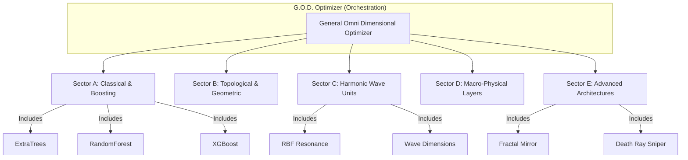

# HRF System Architecture

The Harmonic Resonance Fields (HRF) system is a multi-layered architecture that bridges classical machine learning with physical wave mechanics.

## 1. High-Level Architecture (Titan-26)

The HRF Titan-26 architecture is orchestrated by the **G.O.D. Optimizer**, which dynamically manages 26 dimensions of unified intelligence.

---

## 2. Beginner-Friendly Analogy: The Resonant Orchestra

Imagine a crowded room where many people are talking at once (this is your **Noisy EEG Data**).

1.  **The Bipolar Filter:** You use a special microphone that ignores background hum and only picks up the *differences* in sound between two points.
2.  **The Tuning Fork (Resonance):** Each training point is like a tuning fork. When a new sound (data point) enters the room, the tuning forks for "Class A" hum at one frequency, and "Class B" forks hum at another.
3.  **The Orchestra (Ensemble):** Instead of one tuning fork, we have a whole orchestra. If the "Class A" section is vibrating with more total energy than the "Class B" section, the system identifies the sound as "Class A."

---

## 3. Repository Structure Guide

For new contributors, here is how the repository is organized:

-   `HRF-Engine/`: The "Engine Room." Contains the core mathematical implementations of the resonance algorithms.
-   `HRF Codes/`: The "Application Lab." Real-world scripts and notebooks, specifically for EEG analysis and conference benchmarks.
-   `docs/`: The "Library." Technical monographs, pipeline overviews, and deep-dive architecture docs.
-   `Research Paper/`: The "Archive." Drafts and final versions of the formal whitepapers and research publications.
-   `1/`: The "Prototype Workshop." Early experimental notebooks and raw benchmark results.

---

## 4. Technology Stack

-   **Language:** Python 3.10+
-   **Parallel Computing:** NVIDIA RAPIDS (cuML), CuPy (for GPU-accelerated wave interference)
-   **Machine Learning:** Scikit-learn (BaseEstimator compatibility)
-   **Data Processing:** NumPy, Pandas, SciPy

---
*Next Step: Explore the [Pipeline Overview](./pipeline_overview.md) to see how data flows through this architecture.*
