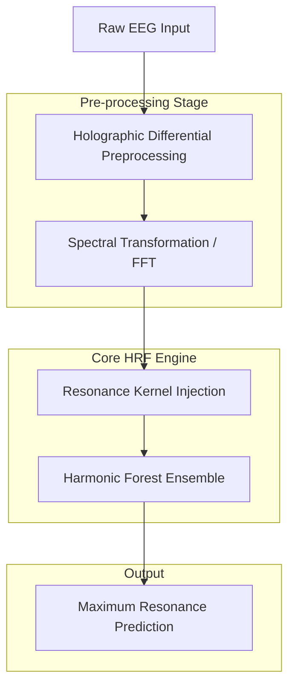

# HRF Pipeline Overview

This document provides a detailed breakdown of the Harmonic Resonance Fields (HRF) processing pipeline, tracing the path from raw signal acquisition to final classification.

## 1. System Flowchart

The following diagram illustrates the end-to-end data flow within the HRF framework:

---

## 2. Step-by-Step Workflow

### Stage 1: Holographic Differential (Bipolar Montage)
Raw sensor data often contains "common-mode noise"—artifacts like body movement or heartbeat that affect all electrodes simultaneously.
- **Action:** The system calculates the difference between adjacent sensors (e.g., $Ch1 - Ch2$, $Ch2 - Ch3$).
- **Result:** This creates a "Holographic Manifold" where the focus is on the differential signal relative to the brain's topology, significantly improving the Signal-to-Noise Ratio (SNR).

### Stage 2: Spectral Transformation (FFT)
To achieve **Phase Invariance**, the time-domain signals are often transformed into the frequency domain.
- **Action:** Applying Fast Fourier Transform (FFT) or similar spectral mappings.
- **Result:** This ensures that the model detects the *energy* of a brainwave (e.g., Alpha wave) regardless of when the wave cycle started (temporal jitter).

### Stage 3: Resonance Kernel Injection
This is the core physics-informed step. Every training data point is treated as a source of physical wave potential.
- **Action:** The system calculates the wave potential $\Psi$ using the resonance formula:
  $$\Psi(\mathbf{x}, \mathbf{p}_i) = \exp\left(-\gamma \left\| \mathbf{x} - \mathbf{p}_i \right\|^2\right) \cdot \cos\left(\omega_c \cdot \left\| \mathbf{x} - \mathbf{p}_i \right\| + \varphi\right)$$
- **Result:** Data points generate interference patterns. Positive resonance indicates high class-affinity.

### Stage 4: Harmonic Forest Ensemble
To ensure robustness and prevent overfitting, HRF uses an ensemble of resonance estimators.
- **Action:** Multiple "physics experts" (estimators) are trained on different subsets of the data (Bagging).
- **Result:** The forest aggregates the resonance energy from all experts, creating a stable and high-precision decision field.

### Stage 5: Prediction (Maximum Resonance)
- **Action:** The class that exhibits the highest aggregate "Resonance Energy" at the query point is selected.
- **Result:** A robust classification that mirrors physical resonance phenomena.

---

## 3. Summary of Version Capabilities

| Feature | v12.0+ | v15.0 (Stable) | v16.0 (Beta) |
| :--- | :---: | :---: | :---: |
| Bipolar Montage | Yes | Yes | Yes |
| GPU Acceleration | No | Yes (RAPIDS) | Yes (RAPIDS) |
| Evolutionary Search | Basic | Advanced | Parallel (PES) |
| K-Fold Validation | No | Yes | Yes |

---
*For a deeper dive into the mathematical framework, see the [HRF Titan-26 Monograph](./hrf_titan26_monograph.md).*
